# Digital Twin Platform with Unreal Engine, Three.js and Web-Based Scene Editor
### Final Year Project

This repository presents my Final Year Project, a multi-platform digital twin system developed for real-time visualization and interaction with a cultural heritage environment.

The project integrates three complementary platforms:

- **Unreal Engine** for high-fidelity real-time rendering and simulation.
- **Three.js** for browser-based visualization optimized for WebGL.
- **Interactive Building System**, a web application that allows users to create, edit, and persist virtual scenes through a secure backend architecture.

To support these platforms, I developed a complete engineering pipeline covering LiDAR processing, procedural modelling, Blender automation, asset optimization, backend services, and real-time rendering.

---
# Overall Project Architecture

  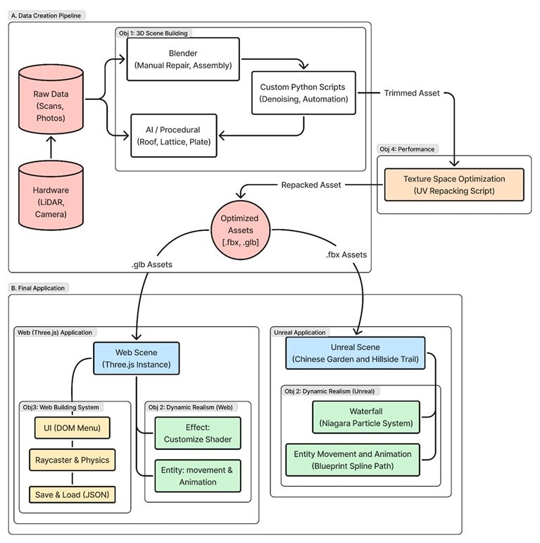

---
## Methodology

The project adopts a hybrid modelling pipeline to select the most suitable technique based on the characteristics of each asset.

    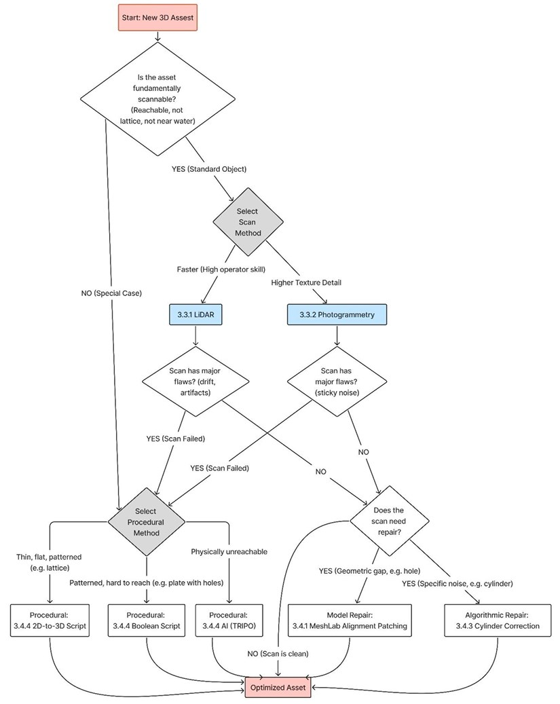

The workflow combines:

- LiDAR scanning
- Photogrammetry
- Procedural Blender generation
- AI-assisted modelling
- Manual refinement

---
# Demo Video 
https://youtu.be/Np9dWAJ1WWE?si=OJ0QvrRnCjOV7s2j

---
# Unreal Engine

High-fidelity immersive digital twin developed in Unreal Engine.

  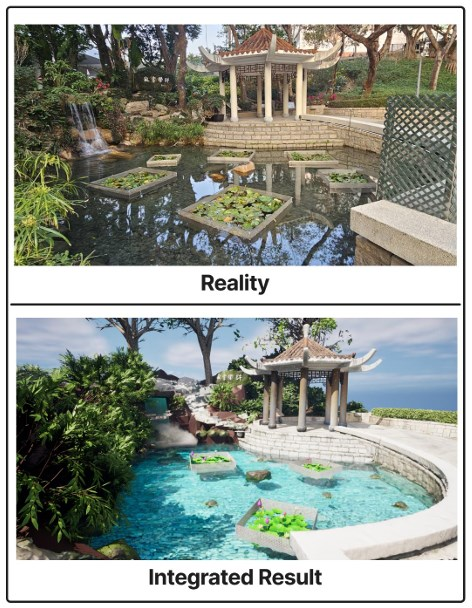

### Purpose

- High-fidelity immersive environment

#### Features

- Digital twin scene
- Turtle AI
- Water simulation
- Dynamic lighting
- Collision setup

# Three.js Web Viewer

Browser-based visualization with optimized WebGL rendering.

  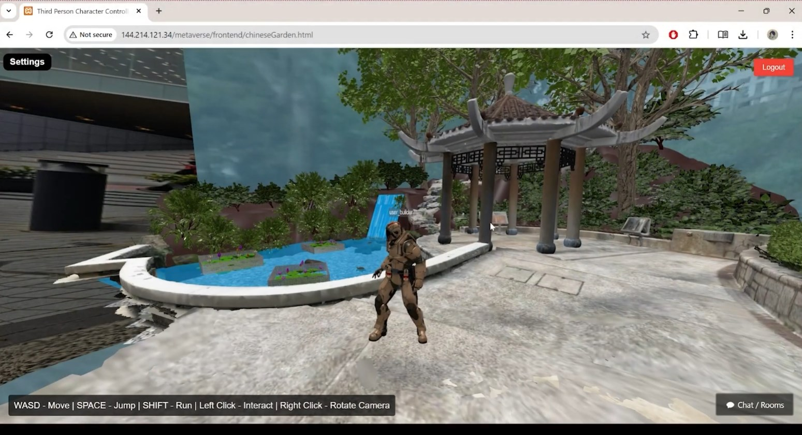

### Purpose

Browser-based visualization.

#### Highlights

- GLB loading
- Dual mesh collision
- Character controller
- WebGL optimization
- Custom shaders

---
# Interactive Building System

  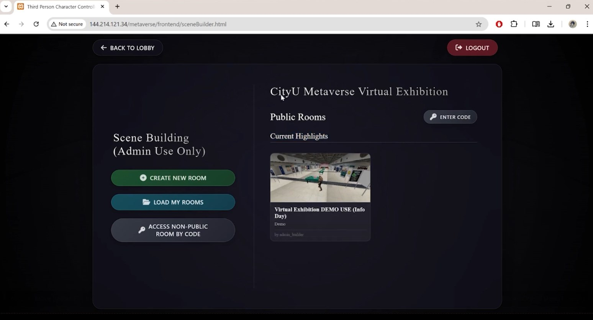
  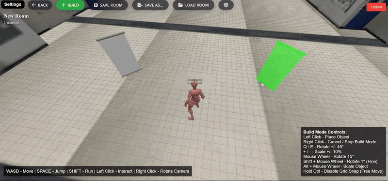

  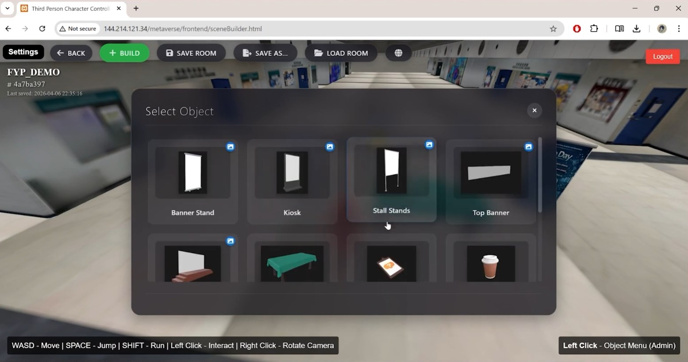
  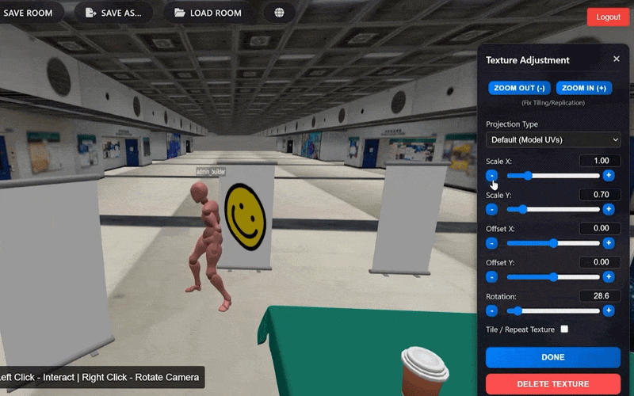

### Purpose

A web-based editor allowing users to place and modify virtual buildings.

#### Highlights

- Object placement
- Transform controls
- Save/Load layouts
- Collision checking
- Asset management

## Overall Backend Architecture

This architecture illustrates how the Three.js building editor communicates with the backend services responsible for authentication, room persistence, asset management, and texture uploads.

 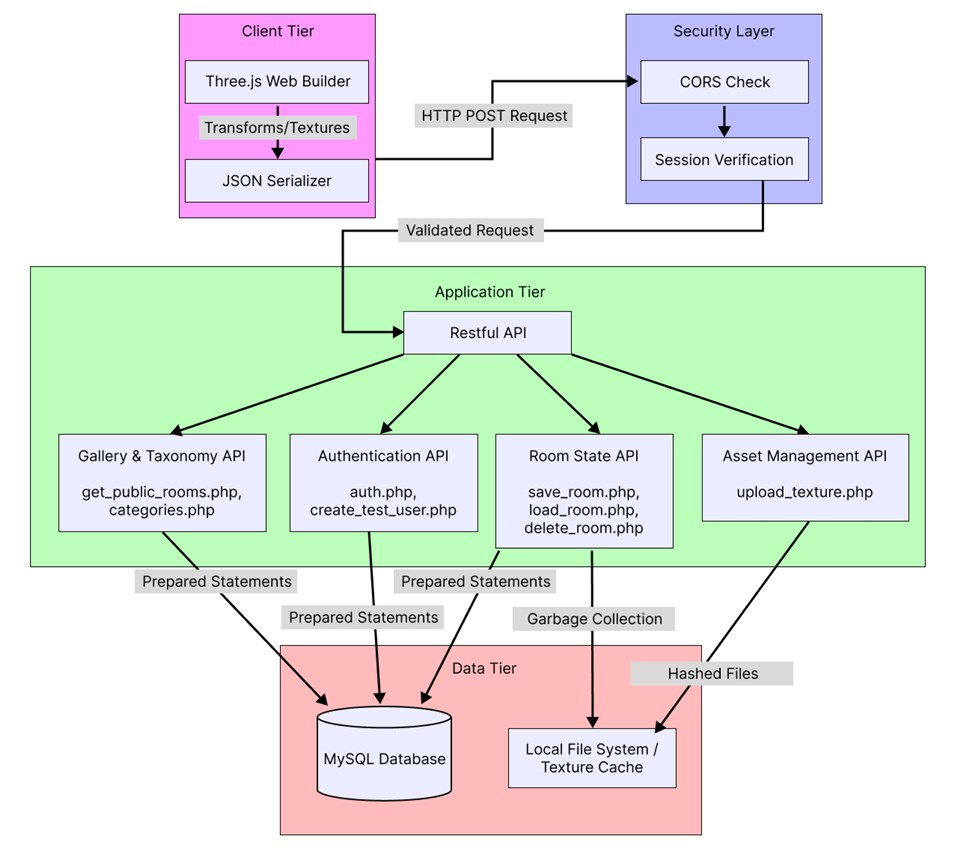 

### Database Design

The interactive building system stores scene layouts using a relational database. Each room contains multiple scene objects, while uploaded textures are managed independently and linked through foreign keys.

 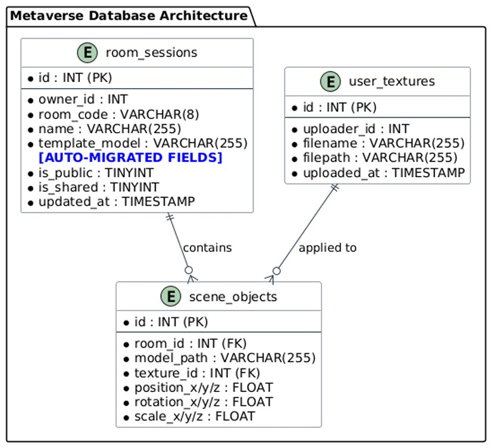 

### Backend Security Pipeline

The backend adopts a layered validation pipeline before any request reaches the database.

Security mechanisms include:

- CORS origin validation
- Ownership verification
- File sanitization
- Parameterized SQL queries
- Secure file storage

 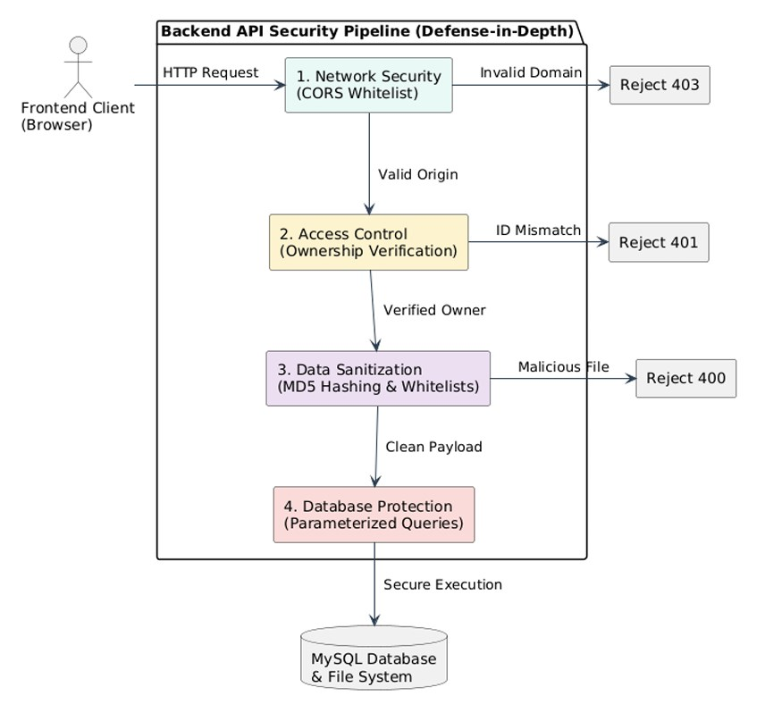 

---
## Engineering Highlights

### Procedural Geometry

- Image → Mesh generation
- Radial symmetry generation

### Performance Optimization

- Dual mesh collision
- Material optimization

### AI Integration

- Hybrid AI modelling
- Asset refinement

### Blender Automation

- Python scripting
- Mesh repair
- Denoising

---
## Key Skills Demonstrated

- Real-time 3D Graphics
- Three.js / WebGL
- Unreal Engine 5
- Blender Python API
- Backend API Development
- MySQL Database Design
- RESTful API Design
- Software Architecture
- Performance Optimization

---
## Asset Availability

The original project was developed as part of a university research project.

University-owned assets, scanned environments, and third-party resources are not included in this repository.

Only code, algorithms, documentation, and demonstrations that I personally developed are provided.